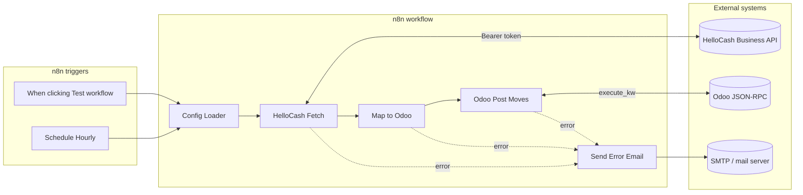

# HelloCash Business → Odoo accounting sync (n8n)

Option B layout: **graph + wiring** live in `src/workflow-template.json`; **Code node logic** lives in `src/nodes/*.js`. `npm run build` produces **`build/helloCash-odoo-sync_workflow.json`** (gitignored) for n8n import.

> **Do not run** the built JSON with `node …` — it is for **n8n import only**. Use **`npm run validate:workflow`** after a build to sanity-check JSON.

## Layout

| Path | Role |
|------|------|
| `src/workflow-template.json` | Workflow skeleton: **only** `name`, `nodes`, `connections`, `settings`, `staticData` (no export-only top-level fields). Code nodes omit `jsCode`; build injects from `src/nodes/`. |
| `src/nodes/*.js` | Code node bodies (source of truth for logic). |
| `scripts/build.mjs` | Merges template + `src/nodes` → `build/helloCash-odoo-sync_workflow.json` with a **whitelist** matching n8n public API create payload (`name`, `nodes`, `connections`, `settings` subset, `staticData`). |
| `scripts/validate-workflow.mjs` | Parses built JSON and checks allowed top-level and `settings` keys (no n8n). |
| `scripts/deploy.sh` | Deploys `build/helloCash-odoo-sync_workflow.json`: preflight GET, PUT or POST, then POST activate. Needs `N8N_BASE_URL`, `N8N_API_KEY`; optional `N8N_WORKFLOW_ID`. |
| `scripts/export.sh` | Stub — extend to pull from n8n into `src/nodes`. |
| `build/` | **Generated** — listed in `.gitignore`. |
| `env/.env.example` | Documents required variables (no secrets). |
| `env/.env.develop` / `env/.env.staging` | Non-secret defaults only; tokens/passwords via n8n or `env/.env.local` (gitignored). |

## Build and import

From **`workflows/helloCash-odoo-sync/`**:

```bash
npm run build
npm run validate:workflow
```

From the **repository root**:

```bash
npm run hellocash:build-workflow
npm run hellocash:validate-workflow
```

Import **`build/helloCash-odoo-sync_workflow.json`** into n8n. Attach **SMTP credentials** on **Send Error Email**. Set environment variables (including on **task runners** if used). Execution always happens **inside n8n**.

## Unit tests

```bash
npm test
```

`pretest` runs **`npm run build`** so tests always read the latest bundle.

| Test file | Node under test |
|-----------|-----------------|
| `tests/config-loader.node.test.mjs` | Config Loader |
| `tests/hellocash-fetch.node.test.mjs` | HelloCash Fetch |
| `tests/map-to-odoo.node.test.mjs` | Map to Odoo |
| `tests/odoo-post-moves.node.test.mjs` | Odoo Post Moves |
| `tests/schedule-hourly.node.test.mjs` | Schedule Hourly |
| `tests/when-clicking-test-workflow.node.test.mjs` | Manual trigger |
| `tests/send-error-email.node.test.mjs` | Send Error Email |
| `tests/email-send-node-credentials.test.mjs` | No SMTP ids in built JSON |

Code nodes run via `tests/harness.mjs` with mocked `$env`, `$('Config Loader')`, `items`, `this.helpers.httpRequest`.

---

## Requirements implemented

| Area | Status | Notes |
|------|--------|-------|
| **Config Loader** | Done | Validates required env vars; builds `hellocash`, `odoo`, `accountMap`, `taxMap`, `retry`, `syncHour`, `errorEmail`. `ODOO_PASSWORD` is checked but **not** emitted in `json` output. |
| **Secrets in env** | Done | No tokens/passwords in workflow JSON; use `$env.*` (and n8n Variables). |
| **HelloCash auth** | Done | Bearer `HELLOCASH_API_TOKEN` on API calls. |
| **Two-phase HelloCash fetch** | Done | (1) `GET` cashbook. (2) `GET` invoices per `cashBook_invoice_number`. Retries on cashbook fetch. |
| **Cancel / void handling** | Done | Skips cancelled cashbook rows and cancelled invoices. |
| **Mapping to Odoo** | Done | Deposits vs withdrawals; payment method; 7%/19% tax; idempotent `ref`. |
| **Odoo JSON-RPC** | Done | `execute_kw` `search_read` + `create`. |
| **Error notification** | Done | **Send Error Email** on Code node error outputs (requires SMTP credential in n8n). |

---

scripts/
├── build.js          ← injects src/nodes/* into workflow template
├── deploy.sh         ← pushes build/ to n8n via API
├── export.sh         ← pulls from n8n, extracts code back to src/nodes/
└── sanitize-workflow.js   ← strips credential IDs and instance-specific fields

## Still to implement or verify

| Item | Why |
|------|-----|
| **Production vs mock** | Re-verify HelloCash live API vs Apiary. |
| **Pagination** | If API is 1-based offset, set `HELLOCASH_CASHBOOK_OFFSET` / `HELLOCASH_INVOICES_OFFSET`. |
| **Post moves in Odoo** | You may need `action_post` after `create`. |
| **deploy.sh** | Set env vars (or use `env/.env.local`), run `npm run deploy` after `npm run build`. |
| **export.sh** | Wire to your n8n REST API if you add pull-from-n8n automation. |

---

## Collaboration diagram



---

## Environment variables (reference)

Required: see `env/.env.example` and `src/nodes/01-config-loader.js`.

Optional: `HELLOCASH_LIST_PATH`, `HELLOCASH_INVOICES_PATH`, `HELLOCASH_QUERY_FROM`/`TO`, `HELLOCASH_CASHBOOK_*`, `HELLOCASH_INVOICES_*`, `HELLOCASH_IGNORE_SYNC_HOUR`, `ERROR_EMAIL_FROM`.
