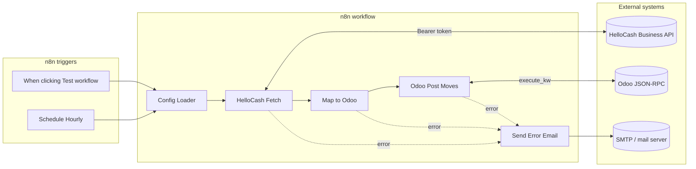

# HelloCash Business → Odoo accounting sync (n8n)

Option B layout: **graph + wiring** live in `src/workflow-template.json`; **Code node logic** lives in `src/nodes/*.js`. `npm run build` produces **`build/helloCash-odoo-sync_workflow.json`** (gitignored) for n8n import.

> **Do not run** the built JSON with `node …` — it is for **n8n import only**. Use **`npm run validate:workflow`** after a build to sanity-check JSON.

## Changelog (major vs minor)

Use this as a high-level release note for operators and reviewers. For exact behaviour, treat **`src/nodes/*.js`** and the built workflow JSON as the source of truth.

### Major (behaviour / integration)

- **HelloCash → Odoo journal entries**: HelloCash **`/api/v1/invoices`** list (tax-aware when the API returns `taxes[]`), mapping to `account.move` payloads, then **Odoo JSON-RPC** `search_read` (idempotency on `ref`) and `create`.
- **Operational safety on HelloCash HTTP**: retries with backoff, optional circuit breaker, richer **attempt history / diagnostics** on terminal failure (masked token, URL, status, body snippet).
- **Odoo write path**: validates `odooVals` before RPC; on create failure, a **post-failure `search_read`** reduces duplicate risk when Odoo accepted the write but the client errored.
- **Revenue without Odoo tax split (fix / behaviour change)**: Map to Odoo **does not** set `tax_ids` on journal lines. Config Loader **no longer** requires `TAX_ID_19` / `TAX_ID_7` or emits `taxMap`. The **gross** HelloCash amount (`cashBook_total`) is credited to the revenue account so Odoo does **not** auto-post separate USt lines from this integration. *(If you need VAT lines, handle them outside this workflow or via Odoo account/tax defaults — not via `tax_ids` from the sync.)*

### Minor (quality / ops)

- **HelloCash URL joining** tolerates `HELLOCASH_BASE_URL` with or without overlapping `/api/v1` path segments.
- **Invoice enrichment**: supports split payments when invoice detail objects expose multiple payment lines; invoice tax fields may still appear in **logs / move `narration`** for operators, but they **do not** drive Odoo `tax_ids`.
- **SKR-style receivables & journals**: optional **`ACCOUNT_EC`**, **`ACCOUNT_KREDITKARTE`**, **`ACCOUNT_FORDERUNGEN`** (default to `ACCOUNT_BANK`); optional **`JOURNAL_KASSE`**, **`JOURNAL_BANK`**, **`JOURNAL_VERKAUF`** (default to `ODOO_JOURNAL_ID`). Credit-card keywords are classified before generic “Karte” so **Visa/Mastercard** map to the **Kreditkarte** bucket, not EC.
- **Odoo RPC logging**: optional verbose payload logging via **`ODOO_DEBUG_LOG`** (password remains redacted in logged RPC bodies).
- **Workflow packaging**: `scripts/build.mjs` injects Code node sources into `src/workflow-template.json`; `scripts/validate-workflow.mjs` checks export-shaped JSON.

## Layout

| Path | Role |
|------|------|
| `src/workflow-template.json` | Workflow skeleton: **only** `name`, `nodes`, `connections`, `settings`, `staticData` (no export-only top-level fields). Code nodes omit `jsCode`; build injects from `src/nodes/`. |
| `src/nodes/*.js` | Code node bodies (source of truth for logic). |
| `scripts/build.mjs` | Merges template + `src/nodes` → `build/helloCash-odoo-sync_workflow.json` with a **whitelist** matching n8n public API create payload (`name`, `nodes`, `connections`, `settings` subset, `staticData`). |
| `scripts/validate-workflow.mjs` | Parses built JSON and checks allowed top-level and `settings` keys (no n8n). |
| `scripts/deploy.sh` | Deploys `build/helloCash-odoo-sync_workflow.json`: preflight GET, PUT or POST, then POST activate. Needs `N8N_BASE_URL`, `N8N_API_KEY`; optional `N8N_WORKFLOW_ID`. |
| `scripts/export.sh` | Stub — extend to pull from n8n into `src/nodes`. |
| `build/` | **Generated** — listed in `.gitignore`. |
| `env/.env.example` | Documents required variables (no secrets). |
| `env/.env.develop` / `env/.env.staging` | Non-secret defaults only; tokens/passwords via n8n or `env/.env.local` (gitignored). |

## Build and import

From **`workflows/helloCash-odoo-sync/`**:

```bash
npm run build
npm run validate:workflow
```

From the **repository root**:

```bash
npm run hellocash:build-workflow
npm run hellocash:validate-workflow
```

Import **`build/helloCash-odoo-sync_workflow.json`** into n8n. Attach **SMTP credentials** on **Send Error Email**. Set environment variables (including on **task runners** if used). Execution always happens **inside n8n**.

## Unit tests

```bash
npm test
```

`pretest` runs **`npm run build`** so tests always read the latest bundle.

| Test file | Node under test |
|-----------|-----------------|
| `tests/config-loader.node.test.mjs` | Config Loader |
| `tests/hellocash-fetch.node.test.mjs` | HelloCash Fetch |
| `tests/map-to-odoo.node.test.mjs` | Map to Odoo |
| `tests/odoo-post-moves.node.test.mjs` | Odoo Post Moves |
| `tests/schedule-hourly.node.test.mjs` | Schedule Hourly |
| `tests/when-clicking-test-workflow.node.test.mjs` | Manual trigger |
| `tests/send-error-email.node.test.mjs` | Send Error Email |
| `tests/email-send-node-credentials.test.mjs` | No SMTP ids in built JSON |

Code nodes run via `tests/harness.mjs` with mocked `$env`, `$('Config Loader')`, `items`, `this.helpers.httpRequest`.

---

## Requirements implemented

| Area | Status | Notes |
|------|--------|-------|
| **Config Loader** | Done | Validates required env vars; builds `hellocash`, `odoo` (incl. `journalKasse` / `journalBank` / `journalVerkauf`), `accountMap`, `retry`, `syncHour`, `errorEmail`. Optional **`ACCOUNT_EC`**, **`ACCOUNT_KREDITKARTE`**, **`ACCOUNT_FORDERUNGEN`**, **`JOURNAL_*`** default to bank journal / `ACCOUNT_BANK` when unset. `ODOO_API_KEY` is checked but **not** emitted in `json` output. |
| **Secrets in env** | Done | No tokens/passwords in workflow JSON; use `$env.*` (and n8n Variables). |
| **HelloCash auth** | Done | Bearer `HELLOCASH_API_TOKEN` on API calls. |
| **HelloCash invoices fetch** | Done | `GET /api/v1/invoices` with date range + pagination; retries on list fetch. |
| **Cancel / void handling** | Done | Skips cancelled invoice/cashbook-shaped rows when cancellation flags are set. |
| **Mapping to Odoo** | Done | Deposits vs withdrawals; **CASH / EC / CREDITCARD / FORDERUNGEN / VOUCHER** → `accountMap`; **gross** revenue **without** `tax_ids`; `journal_id` from **JOURNAL_KASSE** / **JOURNAL_BANK** / **JOURNAL_VERKAUF** (see README); idempotent `ref`. |
| **Odoo JSON-RPC** | Done | `execute_kw` `search_read` + `create`. |
| **Error notification** | Done | **Send Error Email** on Code node error outputs (requires SMTP credential in n8n). |

---

`scripts/` (this package)

- `build.mjs` — merge template + `src/nodes` → `build/helloCash-odoo-sync_workflow.json`
- `validate-workflow.mjs` — structural checks on the built JSON
- `sanitize-workflow.mjs` — strip credential IDs / instance-only fields from an export
- `deploy.sh` — push `build/` to n8n via API (`N8N_BASE_URL`, `N8N_API_KEY`, optional `N8N_WORKFLOW_ID`)
- `export.sh` — stub for future pull-from-n8n automation

## Still to implement or verify

| Item | Why |
|------|-----|
| **Production vs mock** | Re-verify HelloCash live API vs Apiary. |
| **Pagination** | If API is 1-based offset, set `HELLOCASH_CASHBOOK_OFFSET` / `HELLOCASH_INVOICES_OFFSET`. |
| **Post moves in Odoo** | You may need `action_post` after `create`. |
| **deploy.sh** | Set env vars (or use `env/.env.local`), run `npm run deploy` after `npm run build`. |
| **export.sh** | Wire to your n8n REST API if you add pull-from-n8n automation. |

---

## Collaboration diagram



---

## Environment variables (reference)

Required: see `env/.env.example` and `src/nodes/01-config-loader.js`.

Optional (HelloCash / ops): `HELLOCASH_QUERY_FROM`/`TO`, `HELLOCASH_CASHBOOK_*`, `HELLOCASH_INVOICES_*` (pagination limit/offset env names), `HELLOCASH_IGNORE_SYNC_HOUR`, `ERROR_EMAIL_FROM`.

Optional (Odoo SKR-style — when unset, EC/KK/Forderungen debit use **`ACCOUNT_BANK`**, and **`JOURNAL_*`** use **`ODOO_JOURNAL_ID`**):

| Variable | Typical SKR03 (codes) | Role |
|----------|----------------------|------|
| `ACCOUNT_EC` | 1361 EC-Karten | Debit bucket for **EC** / Girocard-style payments |
| `ACCOUNT_KREDITKARTE` | 1362 Kreditkarten | Debit bucket for **Visa/Mastercard/Amex**-style payments |
| `ACCOUNT_FORDERUNGEN` | 1400 Lieferforderungen | Debit bucket when payment text matches **open invoice / receivable** heuristics (`FORDERUNGEN`) |
| `JOURNAL_KASSE` | — | Odoo `account.journal` id for moves that are **only** Bar / Gutschein |
| `JOURNAL_BANK` | — | Odoo journal id when the move includes **EC** or **credit card** lines |
| `JOURNAL_VERKAUF` | — | Odoo journal id when the move includes **FORDERUNGEN** (open invoice) lines |

If a split payment mixes methods, journal is chosen in order: any **FORDERUNGEN** → `JOURNAL_VERKAUF`; else any **EC**/**CREDITCARD** → `JOURNAL_BANK`; else **`JOURNAL_KASSE`**.

# Deployment

./deploy-n8n-odoo-sync.sh deploy      # Full deployment
./deploy-n8n-odoo-sync.sh configure  # Fetch Odoo config only
./deploy-n8n-odoo-sync.sh start       # Start stack
./deploy-n8n-odoo-sync.sh stop        # Stop stack
./deploy-n8n-odoo-sync.sh logs        # View logs
./deploy-n8n-odoo-sync.sh backup      # Backup data
./deploy-n8n-odoo-sync.sh restore     # Restore from backup
./deploy-n8n-odoo-sync.sh destroy     # Remove everything
