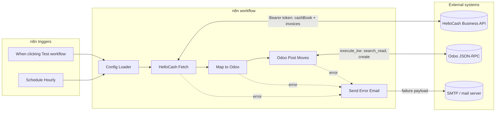
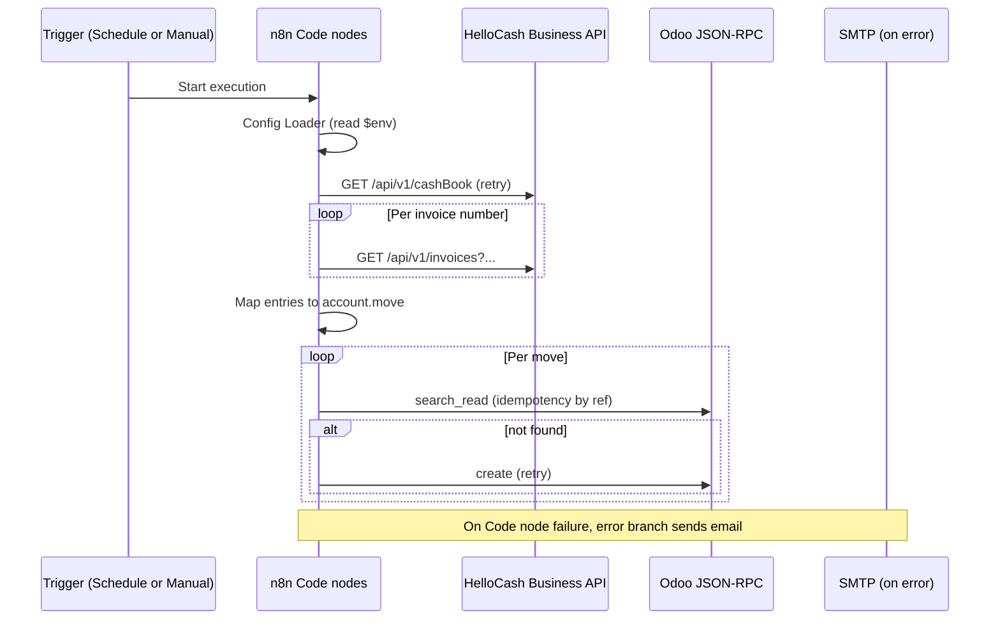

# HelloCash Business → Odoo accounting sync (n8n)

This folder holds **source Code node bodies** (`src/*.js`), a **builder** (`build-workflow.mjs`), and the **generated** n8n import file (`helloCash-odoo-sync.workflow.json`). The workflow syncs **cashbook entries** from HelloCash Business into **Odoo `account.move`** journal entries.

> **Do not run** `node helloCash-odoo-sync.workflow.json` (or any path to that file). Node will error with `ERR_IMPORT_ATTRIBUTE_MISSING`: the file is **JSON for n8n to import**, not a JavaScript program. To check the file, use **`npm run validate:workflow`** from this folder, or **`npm run hellocash:validate-workflow`** from the **repository root**.

## Build and import

From the repository root:

```bash
node workflows/helloCash-odoo-sync/build-workflow.mjs
# optional: validate the generated JSON
npm run hellocash:validate-workflow
```

From **`workflows/helloCash-odoo-sync/`**:

```bash
npm run validate:workflow
```

Import **`helloCash-odoo-sync.workflow.json`** into n8n (Workflow → Import from file). Attach **SMTP credentials** on **Send Error Email** and set all required environment variables (including on **task runners** if you use them). **Running the workflow always happens inside n8n**, not with `node …workflow.json`.

## Unit tests (one file per workflow node)

From **`workflows/helloCash-odoo-sync/`**:

```bash
npm test
```

| Test file | Node under test |
|-----------|-----------------|
| `tests/config-loader.node.test.mjs` | Config Loader |
| `tests/hellocash-fetch.node.test.mjs` | HelloCash Fetch |
| `tests/map-to-odoo.node.test.mjs` | Map to Odoo |
| `tests/odoo-post-moves.node.test.mjs` | Odoo Post Moves |
| `tests/schedule-hourly.node.test.mjs` | Schedule Hourly (workflow JSON contract) |
| `tests/when-clicking-test-workflow.node.test.mjs` | When clicking 'Test workflow' (workflow JSON contract) |
| `tests/send-error-email.node.test.mjs` | Send Error Email (workflow JSON contract) |

Code nodes are executed via `tests/harness.mjs` (`new Function` / `AsyncFunction`) with mocked `$env`, `$('Config Loader')`, `items`, and `this.helpers.httpRequest`. Trigger and email tests assert **`helloCash-odoo-sync.workflow.json`** shape (regenerate with `build-workflow.mjs` after workflow changes).

---

## Requirements implemented

| Area | Status | Notes |
|------|--------|--------|
| **Config Loader** | Done | Validates required env vars; builds `hellocash`, `odoo`, `accountMap`, `taxMap`, `retry`, `syncHour`, `errorEmail`. `ODOO_PASSWORD` is checked but **not** emitted in `json` output. |
| **Secrets in env** | Done | No tokens/passwords in workflow JSON; use `$env.*` (and n8n Variables). |
| **HelloCash auth** | Done | Bearer `HELLOCASH_API_TOKEN` on API calls. |
| **Two-phase HelloCash fetch** | Done | (1) `GET` cashbook with Apiary-style query: `limit`, `offset`, `search`, `dateFrom`, `dateTo`, `mode`, `showDetails` (`HELLOCASH_QUERY_FROM`/`_TO` → `dateFrom`/`dateTo`). (2) `GET` invoices with `search=<cashBook_invoice_number>`, same param shape; pick row where `invoice_number` matches. Retries on cashbook fetch. |
| **Cancel / void handling** | Done | Skips `cashBook_cancellation === "1"`; skips invoices with `invoice_cancellation === "1"`. |
| **Mapping to Odoo** | Done | Deposits vs withdrawals; payment method from `invoice_payment` → `CASH` / `EC` / `CREDITCARD` / `VOUCHER`; tax from `taxes[0].tax_taxRate`; **7% / 19%** via `TAX_ID_7` / `TAX_ID_19`; invoice rate **20** maps to **19%** Odoo tax id. Tax on **revenue (credit) line** for deposits. `narration` + stable `ref` `HC-{number}-{id}`. |
| **Odoo JSON-RPC** | Done | `execute_kw` to `account.move` `search_read` (idempotency) and `create`. Uses `$env.ODOO_PASSWORD`. |
| **Retry (NFR-style)** | Done | `maxAttempts: 3`, `intervalMs: 300000` on HelloCash cashbook GET and Odoo create loop. |
| **Idempotency** | Done | Skip create if `ref` already exists on `account.move`. |
| **Schedule** | Done | **Schedule Hourly** + optional **`SYNC_HOUR`** gate in HelloCash Fetch; **`HELLOCASH_IGNORE_SYNC_HOUR`** for tests. |
| **Manual test** | Done | **When clicking 'Test workflow'** → same chain as Schedule (avoids empty runs when Schedule does not emit items in the editor). |
| **Error notification** | Done | **Send Error Email** on Code node **error** outputs (SMTP). |
| **Execution timeout** | Done | Workflow setting `executionTimeout: 7200` (seconds) in generated JSON to allow long retry waits. |

---

## Still to implement or verify (you / follow-up work)

These are **not** fully covered by the current workflow or need validation against your live HelloCash Business API and Odoo version.

| Item | Why |
|------|-----|
| **Production vs mock** | Apiary mock uses `search` + `dateFrom`/`dateTo`; production `api.hellocash.business` might differ—re-verify before go-live. |
| **Pagination base** | Mock shows `offset=1`; code defaults `offset=0`. If the live API is 1-based, set `HELLOCASH_CASHBOOK_OFFSET` / `HELLOCASH_INVOICES_OFFSET`. |
| **Post / validate moves in Odoo** | Workflow creates `account.move` records. Your Odoo setup may require **`action_post`** (or equivalent) for posted state; add a node or RPC call if needed. |
| **Multi-tax invoices** | Only the **first** tax line (`taxes[0]`) drives the rate. Invoices with **multiple VAT rates** need extra lines or split moves (future enhancement). |
| **`GET /api/v1/cashBook/saldo`** | Not used; optional for reconciliation reports. |
| **Z-reports / TSE / end-of-day** | Mentioned as future in the original design; not implemented. |
| **`cashBook_employee_id` → analytic** | Not mapped to Odoo analytic accounts. |
| **AUTO_DEPOSIT_CASH / Bank–Kasse sweep** | Not implemented. |
| **Success notifications / metrics** | Only failure email path; no success summary or dashboard. |
| **Odoo `create` argument shape** | If your Odoo version expects a different `line_ids` / `tax_ids` format, adjust `03-map-to-odoo.js` and test in a staging database. |

---

## Collaboration diagram

The diagram shows **who talks to whom** during a normal sync run (main path). Error path goes to SMTP only.



### Sequence (main path)



---

## Repository layout

| Path | Role |
|------|------|
| `src/*.js` | Editable **Code node** sources (single source of truth for logic). |
| `build-workflow.mjs` | Node script that embeds `src` into the workflow JSON. |
| `helloCash-odoo-sync.workflow.json` | **Generated** file for n8n import (re-run builder after editing `src`). |

---

## Environment variables (reference)

Required (see `01-config-loader.js` for the canonical list): `HELLOCASH_BASE_URL`, `HELLOCASH_API_TOKEN`, `ODOO_*` (including `ODOO_PASSWORD`), account IDs, `TAX_ID_19`, `TAX_ID_7`, `SYNC_HOUR`, `ERROR_EMAIL`.

Common optional: `HELLOCASH_LIST_PATH`, `HELLOCASH_INVOICES_PATH`, `HELLOCASH_QUERY_FROM`, `HELLOCASH_QUERY_TO` (cashbook + invoice `dateFrom`/`dateTo`), `HELLOCASH_CASHBOOK_*` / `HELLOCASH_INVOICES_*` (`LIMIT`, `OFFSET`, `SEARCH`, `MODE`, `SHOW_DETAILS`, per-phase `DATE_FROM`/`DATE_TO`), `HELLOCASH_DAYS_BACK` (metadata), `HELLOCASH_IGNORE_SYNC_HOUR`, `ERROR_EMAIL_FROM`.
